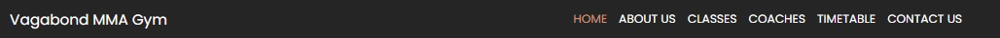

# Vagabond MMA Website
A modern, responsive website for Vagabond MMA, showcasing its unique features, classes, and services. Built with HTML, CSS, and Bootstrap, the website aims to attract potential members and provide a seamless browsing experience.
## Table of Contents
- [Overview](#overview)
- [Features](#features)
- [Testing](#testing)
- [Deployment](#deployment)
- [Credits](#credits)
- [Screenshots](#screenshots)

- ## Overview
Vagabond MMA is a responsive and performance-optimized website designed for an MMA gym. The project showcases a structured and user-friendly interface, providing essential information about the gym’s classes, coaches, schedule, and contact details.

The website is built with modern web technologies (HTML5/CSS/Bootstrap5), ensuring fast load times, mobile responsiveness, and SEO optimization. It includes key features such as an embedded promotional video, dynamic class schedules, and an intuitive navigation system to enhance user experience.

This is a web development project built with accessibility, performance and maintainability in mind.
--------------
## Features

### Existing Features

__Navigation Bar__
- The navigation bar is present on all pages of the Vagabond MMA Project
- It is positioned at the top of the of every page, encouraging intuitive and easy navigation for all important sections like (Home, Classes, Contact etc.)
- Designed with intended responsiveness, the nav bar is adapting to all screen sizes, featuring a hamburger collapsable menu on smaller screen sizes for a better and cleaner UX.

__Landing/Hero Sections__
- __Home, Classes, About and Coaches__
- The Home landing page features a quick introduction accompanied by a promo video, followed by brief sections showcasing the pages contents accompanied with a quick access link for intuitive and easy navigation.

- The Classes Page features a hero landing paralax image accompanied with text representing navigation coordination. This is all followed by classes content card sections that provide visual engagement with pictures and encourages the user to click on them for extra info pertaining them. Beneath it is the final section containing a link targeting the contact section where the sign up form is located.

- The About section also features a hero landing paralax image accompanied with text to represent navigation. This is followed by a short double paragraph (single for sm screens) introduction, a double image section (single for sm screens) and a small testimony section (urther development can be made to transform the testimonial section into a carousel slider once more testimonials are created).

- The Coaches page has a matching hero landing design as the other two, a quick introductory text to entice the user into checking the range of coaches in the team. This is followed by a responsive row of columns that contains the coaches image, title, and brief description of their expertise. And beneath it all a final section containing the link for contact/sign up page.

- __Timetable and Contact Us__
- Compared to the previous pages, these two contain a simple landing hero that does not contain media or effects, its purpose its to simply inform the user of the current page he is on.

__(for UX story look up Classes section)__

- The Timetable/Schedule page contains a single table presenting the schedule information, color coded for navigation (the table is not made to fully be responsive due to the sheer amount of content it has). For consistency and encouragement the pages final section is the same contact us/form link.

 - The Contact us page also has a simplistic landing/hero section in the top. It is followed by 2 coulmn section (1 col for sm screens) that features a Free trial sign up form with validation required (upon submitting the user is redirected to a success page to confirm form submission). The same section  also provide crucial info for the user when engaging the page. In the final section there is a GoogleMaps iframe showing the address of the MMA Gym.
 
 - __Footer__
 - The footer section is present on all pages, and its comprised of 2 responsive layout rows.
 - The first row contains a quick  navigation links through the page.
 - The second row contains social media icons for better UX.

 - __Features left to implement/Design changes__
 - Table containing schedule info can be presented in a different media/style. Or removed and incorporated as a downloadable PDF/JPG.
 - Form completion can involve JS to ensure data processing, and be presented with a Modal.
 - Testimonials section can be restyled into a carousel slider to improve UX.

## Testing
The testing done for this project are as follows:
- HTML Validator
- CSS Validator
- Lighthouse
<!-- List of info/images to explain validators/lighthouse -->
### Validator testing and Lighthouse

### Bugs/Style issues

- HR tag presented errors in validator, so style change was done using border-top

## Deployment
- __The site was deployed to GitHub pages__
- The repo is public to view and edit.
- It can be deployed through the settings tab (pages section)
The live link for the project repo: https://synthslav.github.io/MMA-Gym-M1-project/index.html

## Credits
- Font imports are taken from Google Font.
- Images are taken from various sources on Google Images.
- Home landing video promo is taken from youtube channel Golden Core Studios.
- Map section code taken from Google Maps.
- Icons for footer and Classes cards were taken from Font Awesome.
- Icons for the page tab (and previously navbar logo) were generated using Favicon and their guide.